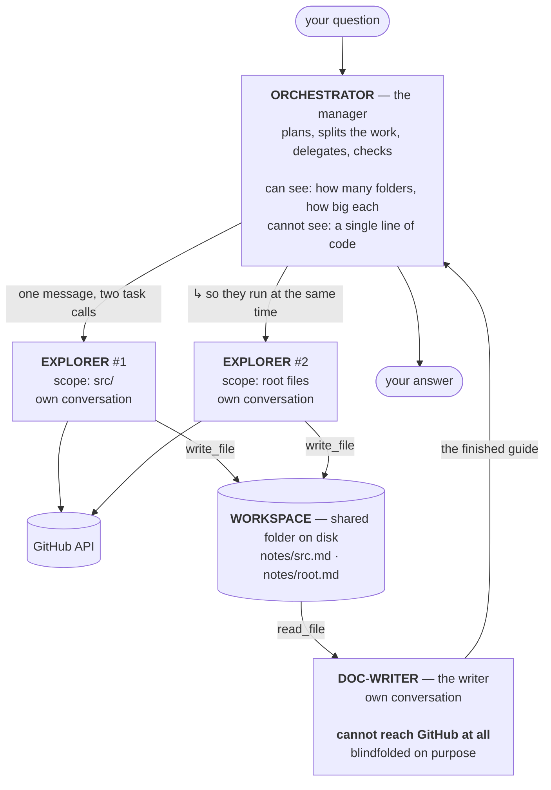

# Architecture

How Repo Cartographer works, why it is built this way, and what one real run
looks like from start to finish.

This document assumes no prior knowledge of the codebase. If you want the short
version: **one AI agent was split into four, so that no single one has to hold an
entire repository in its head.** Everything below is the detail of that sentence.

- [What the project does](#what-the-project-does)
- [The problem it is built around](#the-problem-it-is-built-around)
- [The four agents](#the-four-agents)
- [The files, and how they connect](#the-files-and-how-they-connect)
- [A real run, step by step](#a-real-run-step-by-step)
- [The handoff contract](#the-handoff-contract)
- [Ten decisions that are the architecture](#ten-decisions-that-are-the-architecture)
- [What it costs](#what-it-costs)
- [Failure modes we have actually seen](#failure-modes-we-have-actually-seen)
- [How to verify any of this](#how-to-verify-any-of-this)
- [Known limitations](#known-limitations)

---

## What the project does

You give it a public GitHub repository and a question. It reads the real code and
writes you an onboarding guide.

```console
$ uv run main.py "Explore psf/requests and explain its architecture: what the main
  modules are, where the Session object is defined, and how requests.get ends up
  sending an HTTP request."
```

It never clones anything. It reads through the GitHub API, decides which files are
worth opening, opens those, and answers from what it actually read. The output has
a fixed shape: what the repository is, its architecture, a *where things happen*
table, and — importantly — an explicit list of what it did **not** look at.

---

## The problem it is built around

An AI model has no memory between turns. Everything it needs to know has to be
re-sent on every single request.

So when an agent reads a file, that file's contents join the conversation — and
then get re-sent on the next turn, and the next, and the next. Read four source
files and you are paying for all four again at every subsequent step.

```
turn 1:  [question]                                          →  small
turn 2:  [question][file list]                                →  bigger
turn 3:  [question][file list][sessions.py 800 lines]         →  bigger
turn 4:  [question][file list][sessions.py][adapters.py]      →  bigger
turn 5:  [question][file list][sessions.py][adapters.py][...] →  expensive
                    ↑
         all of this is re-sent, every single turn
```

Two limits bite. A **cost** limit, because you pay per turn for everything sent.
And a **hard** limit, because a conversation eventually exceeds what the model can
accept at all, and no amount of money fixes that.

This project attacks the problem twice, in two different ways:

| | Mechanism | What it does |
|---|---|---|
| **Phase 3** | Offloading | A file too large gets stashed on disk and replaced in the conversation with a preview plus a path. You pay for it **once**, then tidy up. |
| **Phase 4** | Context quarantine | The file is read in a *different conversation entirely*, one the main agent cannot see. It never enters the main thread **at all**. |

Phase 4 is what this document is mostly about. Offloading still runs, inside the
agents that do the reading.

---

## The four agents

Each agent runs its own separate conversation with the model. They cannot see each
other's conversations.



| Agent | Can reach GitHub? | Can write? | Job |
|---|---|---|---|
| **orchestrator** | shape only — folder names and file counts | no | Decide how to divide the repo, brief the others, verify their output, relay the guide |
| **explorer** (up to 3) | yes — tree, file contents, code search | yes, its own notes file | Read one top-level directory and write down what is in it |
| **doc-writer** | **no** | no | Turn the notes into the guide |

The asymmetry is the design. Read on for why each blank in that table is
deliberate.

### Why the doc-writer is blindfolded

The single worst failure available to this project is **confidently describing a
file that does not exist.** A guide that cites `src/requests/router.py` is worse
than no guide, because a reader will trust it and go looking.

In Phase 3 we fought that with instructions — four separate bullet points in the
prompt asking the agent to please only cite files it actually opened. Instructions
are a request, not a guarantee.

The doc-writer has **no tools that can reach GitHub.** It physically cannot look at
code, so it cannot describe code it did not read. Everything it writes must trace
back to a note some explorer left on disk.

> A capability withheld beats an instruction repeated.

That is the argument for splitting agents up, in one line. In the code it is one
line too — `"tools": []` in `agent.py`.

### Why the orchestrator had its reading tools taken away

This one is counterintuitive: the manager *used* to be able to read code, and we
removed it.

If it can read a file itself, it will. Delegating costs it extra turns and requires
trusting a report it cannot verify; reading the file directly is one step. A model
takes the short path for the same reason a person would. You would end up with a
delegation system nobody uses and results identical to Phase 3.

So it keeps exactly one repository tool, `get_repo_scopes`, which answers *"how
does this repo divide up?"* and nothing else:

```python
>>> get_repo_scopes("psf", "requests")
[{"scope": "tests", "files": 61},
 {"scope": "src",   "files": 42},
 {"scope": "docs",  "files": 30},
 {"scope": ".",     "files": 8}]
```

Enough to split the work. Not enough to do it. Anything about what the code
actually *says* has to come back from an explorer.

---

## The files, and how they connect

```
   tools.py         models.py        prompts.py       middleware.py
   ─────────        ─────────        ──────────       ─────────────
   4 functions      the model        3 job            hides tools
   over GitHub      + request        descriptions     from the
   REST API         queue            (plain strings)  orchestrator
       │                │                 │                │
       └────────────────┴────────┬────────┴────────────────┘
                                 ▼
                            agent.py
                    the org chart — the ONLY file
                   that imports the other four
                                 │
      ┌───────────────┬──────────┴──────────┬────────────────────┐
      ▼               ▼                     ▼                    ▼
   main.py     show_contexts.py       run_evals.py        test_wiring.py
    (CLI)      (measures a run)       (scores six)     (asserts the org chart)

   __init__.py ───────► tools.py only, never agent.py
   tests/test_tools.py ► tools.py only
   tests/test_evals.py ► tools.py + tests/evals/, never agent.py
```

**The shape is the point.** The four modules on the top row import *nothing* from
this project. That makes each one independently testable and independently
replaceable — swap the model, and you touch one file; reword a prompt, one file.
`agent.py` is the single place where they are composed into a working system.

| File | What lives there | Why it is separate |
|---|---|---|
| `tools.py` | `get_repo_tree`, `get_file_contents`, `search_code`, `get_repo_scopes` | The one deterministic layer. No AI code at all, so it can be tested for real against GitHub — 26 live tests, zero mocking |
| `models.py` | Which model, which provider, and the shared request queue | Changing models should never mean editing the agent |
| `prompts.py` | `ORCHESTRATOR_PROMPT`, `EXPLORER_PROMPT`, `DOC_WRITER_PROMPT` | Content, not wiring. Three prompts inline would bury the 20-line graph definition they surround |
| `middleware.py` | `RestrictToolsMiddleware` | Hides built-in tools from the orchestrator per model request |
| `agent.py` | `build_subagents()`, `build_agent()`, `ask()` | The org chart: who reports to whom, who gets which tools |
| `__init__.py` | Re-exports the GitHub tools **and deliberately not `agent`** | Importing `agent` builds a model and needs an API key; re-exporting it would make `import repo_cartographer` fail with no key configured, including during test collection |

### `tools.py` in one glance

```python
get_repo_tree(owner, repo, ref="HEAD")   -> list[str]    # every file path
get_file_contents(owner, repo, path)     -> str          # one file, as text
search_code(owner, repo, query)          -> list[dict]   # find a symbol
get_repo_scopes(owner, repo, ref="HEAD") -> list[dict]   # shape only
```

The split between the first three and the last is load-bearing: the first three
read what a repository **says**, the last reports only its **shape**. Only the last
goes to the orchestrator. Three details worth knowing:

- **Directories are filtered out** of `get_repo_tree`. GitHub's tree API also lists
  directories and submodules, neither of which `get_file_contents` can read —
  passing them through would hand an agent a path that looks readable and is not.
- **A truncated tree raises** rather than returning a partial list. GitHub caps a
  recursive tree and flags the cut; a partial list that *looks* complete would make
  every downstream claim quietly wrong.
- **Transport failures are retried, HTTP answers never are.** All four functions
  go through one helper that retries a dropped or timed-out connection three
  times and then raises `GitHubError` — while a 404 or a 403 is returned to the
  caller immediately, because neither improves by asking again. Added at Phase 5;
  see [failure modes](#failure-modes-we-have-actually-seen) for what it cost to
  find.

---

## A real run, step by step

This is an actual run against `psf/requests`, not an illustration.

### Step 1–2 · the orchestrator plans and sizes up

```
write_todos              (plan first, before touching the repository)
get_repo_scopes("psf", "requests")
  → tests:61, src:42, docs:30, ".":8
```

One GitHub request, regardless of repository size.

### Step 3 · it picks scopes and dispatches — both in one message

The prompt tells it to skip `docs`, `.github`, examples, vendored and generated
directories, and to send at most three explorers. It chose `src` and `.`:

```
┌─ one assistant message ──────────────────────────────────────┐
│ task(explorer, "psf/requests, scope=src,  … → /notes/src.md")  │
│ task(explorer, "psf/requests, scope=.,    … → /notes/root.md") │
└──────────────────────────────────────────────────────────────┘
```

**Both calls in one message is what makes them concurrent.** This is not something
the library arranges — it is the model choosing to emit two calls at once. A run
that sent them one per message would do identical work in identically isolated
contexts, and no token figure would tell the two apart. So it is measured:
`scripts/show_contexts.py` prints a *dispatch shape* of `[2, 1]` — one message
asking for two explorers, then one asking for the doc-writer.

Each brief must stand alone. The explorer cannot ask a follow-up question, so the
brief carries the owner, the repo, **its own** scope, the question in full, and
**its own** notes path.

### Step 4 · each explorer works in its own conversation

```
explorer (scope: src)             explorer (scope: root)
──────────────────────────        ──────────────────────────
get_repo_tree → filter to src/    get_repo_tree → filter to root
get_file_contents __init__.py     get_file_contents pyproject.toml
get_file_contents sessions.py     get_file_contents setup.py
get_file_contents adapters.py     …
get_file_contents models.py
…
write_file /notes/src.md          write_file /notes/root.md
                                  ↑
        ONE write, at the very end, never appended to
```

Real output from that run — `workspace/notes/src.md`, 61 lines:

```markdown
# Architecture Notes: `src/` directory of `psf/requests`

## 1. Overview of Main Modules in `src/requests/`

- **`__init__.py`**: Entry point for the package. Exposes top-level functions
  (`get`, `post`, `request`, etc.), classes (`Session`, `Request`, `Response`) …
- **`sessions.py`**: Defines the `Session` object (and `SessionRedirectMixin`)
  which manages and persists settings across requests (cookies, headers,
  authentication, proxies, connection pools via adapters, …)
```

Then each returns a **three-line spoken report** — not the notes:

> `src/` is the core library: entry points, session management, models and
> transport adapters. Notes written to `/notes/src.md`. I read 8 of 42 files in
> scope; skipped tests and packaging metadata.

That report is all the orchestrator ever sees. The 800-line `sessions.py` stays in
that explorer's conversation and never touches the orchestrator's.

### Step 5 · the orchestrator verifies

```
ls /notes  →  ["root.md", "src.md"]
```

Cheap, and it catches something real: an explorer can *report* success while its
file is missing or somewhere useless. Checking beats trusting, and this is a
miniature preview of Phase 6's link-checker.

### Step 6 · the doc-writer composes

```
ls /notes                    (don't trust the brief's list — verify it)
read_file /notes/src.md
read_file /notes/root.md
→ returns the finished guide as its final message
```

It has two tools, both read-only, both pointed at a folder it did not write. It
writes no file: its final message *is* the guide, generated once. Producing it and
also saving it would mean generating the same text twice.

### Step 7 · the orchestrator relays it verbatim

The orchestrator repeats the doc-writer's message as its own, unedited, and stops.
`ask()` returns that last message. The guide comes back shaped like this:

```markdown
### What this repository is
`psf/requests` is a widely-used Python HTTP library …

### Architecture
- **Entry Point & API (`src/requests/__init__.py` & `api.py`)**: …
- **Session Management (`src/requests/sessions.py`)**: …

### Where things happen
| What you might want to change | File | Function or Class |
| :--- | :--- | :--- |
| Session state, preparation, dispatch | `src/requests/sessions.py` | `Session.request()`, `Session.send()` |
| Connection handling, urllib3, sending | `src/requests/adapters.py` | `HTTPAdapter.send()` |

### What we did not look at
The notes do not cover the test suite, packaging configuration, or documentation …
```

That final section is required by the prompt. A partial map honest about its edges
is useful; one that reads as complete and is not is worse than nothing.

---

## The handoff contract

Because the conversations are isolated, exactly **two** channels carry work between
agents, and there are no others:

1. **A sub-agent's final message** — short, spoken, seen only by its caller.
2. **Files in the shared workspace** — durable, and the real deliverable.

```
./workspace/                  ← one FilesystemBackend instance, shared by all agents
├── notes/
│   ├── src.md                ← explorer #1 writes, doc-writer reads
│   └── root.md               ← explorer #2 writes, doc-writer reads
└── large_tool_results/       ← offloading stashes oversized tool results here
    └── aBqjVMEE
```

Three conventions hold this together, and **none of them is enforced by code** —
which is why all three prompts state them:

| Convention | What breaks without it |
|---|---|
| The orchestrator names the notes path; the explorer writes exactly there | The doc-writer looks somewhere the file is not |
| Every explorer gets a **different** path | Saving replaces a file, so the second explorer to finish erases the first |
| Paths start with `/` and never contain `workspace` | The write succeeds into a folder *inside* the workspace that nobody reads |

That last one is not hypothetical — see [failure modes](#failure-modes-we-have-actually-seen).

---

## Ten decisions that are the architecture

Everything above reduces to about ten lines of code. Each one is here because the
obvious alternative fails in a specific way.

**In `agent.py`:**

| # | Code | Why |
|---|---|---|
| 1 | `backend = FilesystemBackend(root_dir=WORKSPACE)` — **one** instance, shared | This is what makes the workspace a *channel* rather than three private scratch spaces. Sub-agents inherit this instance |
| 2 | `tools=[get_repo_scopes]` on the orchestrator | Give it reading tools and it stops delegating. Removing them makes delegation the only route to the data |
| 3 | `"tools": []` on the doc-writer | The blindfold. Structural guarantee, not an instruction |
| 4 | `FilesystemMiddleware(tools=[...])` restated **inside each sub-agent spec** | A parent's middleware is **not inherited** by declarative sub-agents. Omit this and both delegates get `execute`, `glob`, `grep`, `delete` handed back |
| 5 | `tool_token_limit_before_evict=…` restated on the explorer | Sub-agents default to the library's 20,000. The explorer is the only agent reading files now, so without this the tuned 2,000 sits on the agents that don't need it |
| 6 | `RestrictToolsMiddleware()` **last** in the middleware list | It must run *after* the middleware that inject tools, or there is nothing to remove |
| 7 | `register_harness_profile(…enabled=False)` | Deletes the library's default `general-purpose` sub-agent, which is advertised as having "all tools as the main agent" — now meaning *none* |

**In `models.py`:**

| # | Code | Why |
|---|---|---|
| 8 | `rate_limiter=…` on the **single** model instance | Sub-agents inherit the instance, so all four agents draw from one bucket. The provider's limit is per project, not per agent — four private limiters would spend four times the budget |
| 9 | `ChatGoogleGenerativeAI`, not the OpenAI-compatible endpoint | Gemini 3 models emit an encrypted `thought_signature` with every tool call that must be sent back verbatim. The compatibility layer drops it and turn 2 of any tool loop fails |
| 10 | `ask()` returns `.text`, not `.content` | Gemini fills `content` with typed blocks; printing it dumps a data structure instead of prose. `.text` works for both providers |

---

## What it costs

Same question, same repository, three architectures:

| | Phase 3 · one agent | Phase 4b · run A | Phase 4b · run B |
|---|---|---|---|
| Total input tokens | 211,386 | 324,559 | 177,768 |
| **Largest single conversation** | 21,443 | 25,839 | 13,564 |
| The orchestrator's own peak | — | 7,861 | **6,997** |
| Turns | ~15 | 34 | 27 |

Read those numbers carefully, because the obvious conclusions are traps.

**Do not draw a cost conclusion from single runs.** Two runs of the *same*
architecture on the *identical* question came out at 324,559 and 177,768 — one above
Phase 3's total, one below it. The spread between runs of one architecture is wider
than the gap between architectures, because the dominant variable is how many files
the explorers happened to open, and that is a model decision that changes every
time. An earlier draft of this document claimed Phase 4 "costs more"; that claim was
built on one run and it does not survive a second. `scripts/measure_context.py` has
carried this warning since Phase 3 — it takes `--repeats N` and says so itself when
the ranges overlap.

**And do not trust the old instrument at all now.** `scripts/measure_context.py`
reads a finished run's message list, which after Phase 4 is the orchestrator's
conversation *alone*. Its figures collapsed at Phase 4 because the tokens **moved
somewhere it cannot see.** A number that fell because you stopped measuring is worse
than no number, because you will quote it. `scripts/show_contexts.py` exists to see
all four threads, by streaming with `subgraphs=True`.

**So what did you actually buy?** The part that is structural rather than a function
of file choices. The orchestrator stays small no matter how much reading happens —
6,997 tokens here — and the doc-writer produced the entire guide inside 3,888
tokens, because all it ever saw was two note files. **Nobody has to hold the whole
repository at once.** That is what lets this scale to a repository where one growing
conversation would hit a hard wall.

### And concurrency buys no speed here

The free tier allows **15 requests per minute for the whole project**. Two
explorers plus an orchestrator, each stepping through its own tool loop, reach that
in seconds. So `models.py` paces every request through one shared queue at 80% of
the published limit.

Which means the explorers run "in parallel" but finish no sooner than the queue
lets them through. **On a per-minute request budget, concurrency buys separate
contexts — not wall-clock speed.** That is the honest claim for the fan-out.

---

## Failure modes we have actually seen

The first two are the same shape, and it is the shape worth remembering: **in a
delegated system, things do not fail loudly. They succeed somewhere useless.**
The last two are a different lesson, and it is Phase 5's: **a bug that only
appears on some runs is invisible to a person watching some runs.**

**1 · The run died on a rate limit.** The first fan-out attempt:

```
ChatGoogleGenerativeAIError: (RESOURCE_EXHAUSTED) 429 …
Quota exceeded for metric: generate_content_free_tier_requests, limit: 15
Please retry in 1.010311967s.
```

The API's own advice — *retry in one second* — is the tell. This is pacing, not
capacity, so the fix is a client-side queue rather than fewer explorers.

**2 · A note filed into a folder that does not exist to anyone.** That same dead run
left a file at `workspace/workspace/notes/overview.md`. The orchestrator had
briefed a path *including* the `workspace/` prefix — but the workspace **is** the
storage root, so the write created a second folder inside it. The write succeeded.
The explorer reported success. Nothing errored. The doc-writer would simply have
found an empty cabinet. Both prompts now state the path rule explicitly.

**3 · One dropped packet ended a whole mapping.** The first full eval sweep failed
four of six repositories:

```
[1/6] requests (psf/requests) … FAILED after 77.4s — ReadTimeout: api.github.com
[4/6] httpx (encode/httpx) …    FAILED after 101.0s — ConnectionError: RemoteDisconnected
```

Not the model, not a rate limit — the connection to GitHub dropping. The reason it
was fatal is an asymmetry four phases of single runs never surfaced: `GitHubError`
and `ValueError` from the tools layer reach the model as a tool error it can read
and route around, exactly as the prompts promise, but a raw `requests.ReadTimeout`
escaped the agent loop and ended the run. `tools.py` now retries transport
failures — and only transport failures, never an HTTP answer — then raises
`GitHubError`, so a dropped connection is the same kind of event as a 404. Same
four cases, unchanged, on the retry: 5/5, 3/5, 5/5, 6/6.

The point is not the bug. It is that the bug survived every phase in which
verification meant watching a run, and died in the first sweep of a fixed set.

**4 · A test that could never have passed.** While writing the check that the
default `general-purpose` sub-agent was gone, the obvious assertion was *"the word
`general-purpose` does not appear in the tool description."* It failed — because
the description's fixed usage notes mention that name whether the agent is enabled
or not. The test now parses the actual menu. A naive version would have failed
forever for the wrong reason; a slightly different naive version would have passed
forever while checking nothing.

---

## How to verify any of this

```console
$ uv run pytest tests/test_wiring.py -q      # 16 tests · ~1s · ZERO AI calls
$ uv run pytest tests/test_tools.py -q       # 26 tests · live GitHub, no mocking
$ uv run pytest tests/test_evals.py -q       # 37 tests · is the eval set itself true?
$ uv run scripts/show_contexts.py            # one real run, per-agent tokens
$ uv run scripts/run_evals.py                # six repos, one score
$ uv run scripts/run_evals.py --score-only   # re-score recorded runs, free
$ uv run main.py "your question here"        # just use it
```

The first line deserves attention. The claim *"the doc-writer cannot cite a file
nobody read"* is true only while `"tools": []` is in its spec — and if that key
vanished, you would get a plausible guide full of invented paths and **no error
anywhere**. So it is asserted mechanically, in a second, for free.

`tests/test_wiring.py` checks three layers:

- **Spec level** — the dicts this project owns. Stable across library upgrades.
- **Prompt level** — does each prompt name only tools its agent actually has? Catches
  the drift where you narrow an agent's tools and forget the prompt still tells it
  to `ls`.
- **Compiled-graph level** — did the library honour any of it? This one reaches into
  private structure, so it is the test most likely to break on an upgrade. If it
  does, that is a signal worth reading, not a test worth deleting.

### The eval set

Everything above this line was verified by looking — once, on one run, by a human
reading a transcript. That is enough to establish a mechanism exists and not
enough to notice when it stops working. Phase 5 fixes six repositories, writes
down the facts a good guide about each should contain, and prints one number:

```console
$ uv run scripts/run_evals.py

case        repo                    facts  present  missing
-----------------------------------------------------------
requests    psf/requests                5        5  —
flask       pallets/flask               5        5  —
click       pallets/click               5        3  types-module, parser-module
httpx       encode/httpx                5        5  —
express     expressjs/express           6        6  —
chalk       chalk/chalk                 5        5  —
-----------------------------------------------------------
total                                  31       29

29 of 31 expected facts present (94%)
```

The two misses are readable rather than mysterious: mapping `pallets/click`, the
explorers covered `core.py` and `decorators.py` and never opened `types.py` or
`parser.py`, so the guide could not mention them. That is the scope-coverage
question the [known limitations](#known-limitations) could previously only
describe anecdotally, now attached to a number that moves.

The dataset is `tests/evals/known_repos.jsonl` — six cases, thirty-one facts, each
fact either a repo-relative **path** or a **term** that really occurs in a named
file. Nothing is graded by a model. A path either appears in the guide or it does
not, which is what keeps the number from drifting when nobody changed anything.

Two properties are worth knowing before quoting it:

- **It scores recall of citations, not quality.** A guide naming every expected
  file and describing all of them wrongly scores full marks. What the number is
  for is *movement* — same dataset, same questions, before and after a change.
- **The dataset is verified against the live repositories**, by
  `tests/test_evals.py`, with no model involved. This is not bookkeeping: the
  first draft expected `lib/router/index.js` from `expressjs/express`, a path
  every account of Express describes and which the repository has not had since
  routing moved to its own package. Unverified, that would have scored as a miss
  on every run forever — and read as the agent's failure rather than the
  dataset's.

Recorded runs go to `tests/evals/results/` as a growing log, so `--score-only`
re-scores them against the current dataset for free. Each record carries the
model and a fingerprint of all three prompts, and a record whose fingerprint no
longer matches the prompts on disk is reported as stale — because the failure
this instrument invites is editing a prompt, re-scoring without re-running, and
reading an unchanged number as evidence the edit was neutral.

### The trace

`LANGSMITH_TRACING=true` plus a key in `.env` records every run in LangSmith, with
the sub-agents nested inside the root run. `langgraph.json` points at the same graph
for LangGraph Studio. Tracing is provider-independent — it records what the graph
did, not who served the model — so it costs nothing against your model quota.

A traced run of the example above produced one root run containing **31 runs tagged
`ls_agent_type=subagent`** and three `task` invocations:

```
start 11:49:45.338  end 11:50:56.041   explorer     89,426 tokens   70.7s
start 11:49:45.348  end 11:50:20.851   explorer     30,595 tokens   35.5s
start 11:51:15.864  end 11:51:32.711   doc-writer    7,863 tokens   16.8s
```

The two explorers started **10 milliseconds apart** and overlapped for 35.5 seconds.
That is the concurrency claim confirmed server-side, from timestamps rather than
inference — and it is a different kind of evidence from the token table, which shows
the contexts were *separate* but not that they were *simultaneous*.

Notice the first explorer took 70.7s while overlapping for only 35.5s of it. Most of
that remainder was spent waiting on the shared request queue, which is the rate limit
made visible.

---

## Known limitations

**Scope discipline is imperfect, in every run observed so far.** The explorer scoped
to `.` reads into `src/` anyway, despite the prompt telling it to record a
cross-scope dependency and stop. The evidence is the explorer's own notes file,
which lists what it opened:

```
Read files: pyproject.toml, setup.py, src/requests/__init__.py,
            src/requests/api.py, src/requests/sessions.py,
            src/requests/adapters.py
                        ↑ four files belonging to another explorer's scope
```

Severity varies. In one run the root explorer cost *more* than the `src` explorer —
142,194 tokens against 113,964 — which is the drift at its worst: the same files read
twice and paid for twice. In the traced run it stayed proportionate (30,595 against
87,689, matching the 8-vs-42 file split), but it still crossed the line.

That variability is the real problem, and it is what Phase 5 exists to answer. A
rule followed most of the time cannot be verified by looking at one run; the eval
set turns "it seemed fine when I looked" into a number that moves when you change
a prompt. It does not fix scope drift — it makes the cost of the drift, in facts
the guide ends up missing, something you can watch. Both of the eval's current
misses are that cost: mapping `pallets/click`, nobody opened `types.py` or
`parser.py`, so the guide could not mention them. Coverage, not accuracy.

**The workspace is shared between runs, and that is a real hazard.** `./workspace`
is one directory, not one per run, so the notes from the last question are still
sitting there when you ask the next one — and `DOC_WRITER_PROMPT` deliberately
tells the doc-writer to `ls` and read what it finds rather than trusting the
brief's list. Ask about `psf/requests`, then about `pallets/flask`, and flask's
doc-writer can open a notes file full of `requests`. Nothing errors. It is the
same shape as every other failure in this section: it succeeds somewhere useless.
`scripts/run_evals.py` empties the workspace between cases for exactly this
reason, which contains the problem for the eval and not for anyone typing two
`main.py` commands in a row. A per-run workspace is the actual fix and has not
been made.

**The guide can still repeat an explorer's mistake.** The doc-writer cannot invent a
path, but it will faithfully reproduce a wrong one. Verifying cited paths against
the real tree is Phase 6's job — a deliberately non-AI sub-agent that checks every
path the guide cites.

**No good-first-issues section**, though the project promises one. Nothing here can
read an issue tracker yet, so the prompt forbids inferring issues from code rather
than letting the model invent them.

**Three explorers is a hard ceiling**, and it is a budget rather than a design
preference. A fourth does not make a run better; it makes it die part way through.

**No skills yet.** What to look for differs by ecosystem — `pyproject.toml` and
`tests/` for Python, `package.json` and `src/` for Node. Right now that knowledge is
spread through the prompts. Phase 7 moves it into per-ecosystem files loaded only
when relevant.

---

## Where this sits in the build

The project is built one concept at a time, deliberately, so that each phase can be
credited with the change it caused. See
[IMPLEMENTATION_GUIDE.md](IMPLEMENTATION_GUIDE.md) for the reasoning.

| Phase | Concept it isolates | State |
|---|---|---|
| 1 | A deterministic, testable foundation | Done |
| 2 | What the agent harness buys over a bare loop | Done |
| 3 | Context offloading | Done |
| 4a | Context quarantine | Done |
| 4b | Parallel fan-out | Done — trace verified |
| 5 | Measurable regressions (eval set) | Done |
| 6 | Sub-agents ≠ smaller AI calls (link-checker) | Next |
| 7 | Prompt decomposition (skills) | Planned |
| 8 | Approval gates | Planned |
| 9 | Packaging | Planned |
