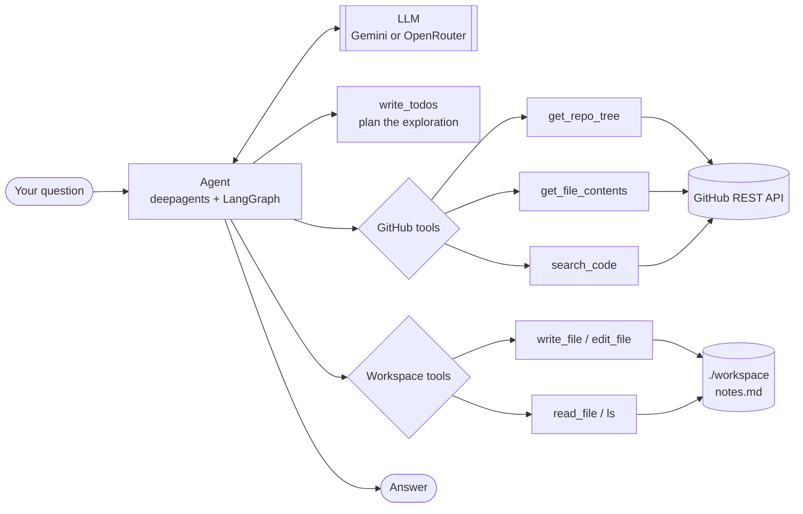

# Repo Cartographer

An AI agent that reads a public GitHub repository and explains it — architecture,
where things happen, and how the pieces fit together.

Instead of cloning a project and reading it top to bottom yourself, you point the
agent at `owner/repo` and ask a question. It walks the file tree, decides which
files are worth opening, reads them, and answers from what it actually found.

Built on [deepagents](https://pypi.org/project/deepagents/) (a LangGraph agent
harness) with a small, deliberately boring GitHub tools layer underneath.

---

## Status

This project is being built in phases, one concept at a time — see
[IMPLEMENTATION_GUIDE.md](IMPLEMENTATION_GUIDE.md) for the full plan and the
reasoning behind the ordering.

| Phase | What it adds | State |
|---|---|---|
| 0 | Environment, packaging, config | Done |
| 1 | GitHub tools layer + tests | Done — 21 tests, no mocking |
| 2 | Bare agent (tools + prompt) | Done |
| 3 | Filesystem backend | Done — this is what runs today |
| 4+ | Sub-agents, evals, skills | Planned |

Phase 2's definition of done — *"in the transcript, it calls the built-in planning
tool before calling any of yours, unprompted"* — is met. On `psf/requests` with
`gemini-3.5-flash-lite`:

```
 0. write_todos       (4 todos, unprompted, before any repository access)
 1. get_repo_tree     psf/requests
 2. write_todos       (tree step → completed)
 3. get_file_contents src/requests/__init__.py
 4. write_todos
 5. get_file_contents src/requests/adapters.py
 6. get_file_contents src/requests/sessions.py
 7. write_todos
 8. write_todos       → then answered in prose
```

Nine tool calls, no wasted ones. The answer correctly located wire-level sending
in `adapters.py` (`HTTPAdapter.send`) and session state in `sessions.py`.

Phase 3's definition of done is a number: run the same task with and without
offloading and watch the message history shrink. `uv run
scripts/measure_context.py` runs both arms and prints the comparison. On
`psf/requests` with `gemini-3.5-flash-lite`:

```
                             offload off            offload on
cumulative input tokens          241,196               211,386
final-turn input tokens           37,786                21,443
results evicted                        0                     2
```

The final-turn figure is the one to read: by the end of the run the thread had
grown to 37.8k tokens without offloading and 21.4k with it, because two file
reads had been written to `workspace/` and replaced in the thread by a preview.
Cumulative input — what the run actually cost, since the thread is re-sent every
turn — fell 12%.

Both numbers are a single run per arm, and the arms are not deterministic: the
model chooses which files to open. `--repeats N` reports the spread instead, and
the script says so itself when the ranges overlap. It also refuses to take credit
it hasn't earned — when nothing crossed the eviction threshold it prints that
fact rather than the difference, which is exactly what happened on the first repo
tried, whose only large file was a lockfile the prompt tells the agent to skip.

What works right now: a single agent with three GitHub tools, a planning tool, and
a workspace it writes findings into. The "write a full onboarding guide" product
is still ahead, and so is everything Phase 4 onward — no sub-agent, no eval set,
no citation checking. Paths in the answer carry the prompt's instruction to cite
only verified ones, not a guarantee; that guarantee is Phase 6's job.

---

## How it works



The agent loops: the model picks a tool, the tool calls GitHub, the result goes
back into the model's context, repeat until it can answer. The three GitHub tools
are plain Python functions — the library derives each tool's schema and
description from its signature and docstring, so `tools.py` is the single source
of truth for what the model knows about them.

There are two namespaces here and keeping them apart is most of the prompt's job.
GitHub is remote and read-only; the workspace is local, writable, and starts
empty, so `read_file` reaches a repository file only after the agent has put one
there. Eight tools reach the model, and both halves of that are deliberate:

- **`write_todos` is added.** It comes from `TodoListMiddleware`, passed
  explicitly — as of deepagents 0.7.3 planning is *not* in the default middleware
  stack. Mapping a repo is several steps deep, so
  [`ORCHESTRATOR_PROMPT`](repo_cartographer/agent.py) asks for a todo list before
  the first tool call, and the agent writes one.
- **Five built-ins are taken away.** `create_deep_agent` also supplies `glob`,
  `grep`, `delete`, a shell (`execute`) and a sub-agent spawner (`task`). Search
  over a workspace holding one file the agent wrote itself tells it nothing;
  `execute` has no sandbox backend to run in and only returns an error; `task` is
  Phase 4's variable, kept out so Phase 3 measures one thing.
  [`middleware.py`](repo_cartographer/middleware.py) hides them. This mattered
  more at Phase 2, when the whole filesystem was hidden: the first model tried
  here spent 8 of 16 tool calls on `read_file("src/foo.py") → not found` before
  the workspace had any purpose, and removing the tools halved what a run cost.
  The set shrinks by one entry per phase, as each phase finds a use for another
  built-in.

**Offloading.** `FilesystemMiddleware` watches every tool result and writes any
one over `TOOL_RESULT_TOKEN_LIMIT` (2,000 tokens, well below the library's 20,000
default) into the workspace, leaving a head-and-tail preview and a path in the
thread. This is what keeps a 10,000-token file from being re-sent on every
subsequent turn, and it applies to the GitHub tools too — the exclusion list in
the library covers only its own built-ins. On top of that the prompt asks the
agent to keep `/notes.md` as it reads and to answer from the notes rather than
from the sources, so what survives to the final turn is the summary and not the
files.

Worth being precise about what the *backend* buys, since it's easy to overclaim:
files land in `./workspace` rather than in graph state, and that is a durability
change, not a context one — a `StateBackend` keeps file contents out of the
message thread just as well. Disk is what lets you read `workspace/notes.md`
afterwards and see what the agent actually wrote down.

**The tools layer** (`repo_cartographer/tools.py`) is intentionally free of any
LLM or agent code. It's ordinary, testable Python:

| Function | Returns | Notable behaviour |
|---|---|---|
| `get_repo_tree(owner, repo, ref="HEAD")` | Every file path in the repo | Files only — directories and submodules are filtered out, since neither can be read. Raises rather than silently returning a truncated tree. |
| `get_file_contents(owner, repo, path)` | The file as a UTF-8 string | Decodes GitHub's base64 for you. Refuses directories, symlinks, binaries, and files over 1 MB with a message naming the actual problem. |
| `search_code(owner, repo, query)` | Matching results | URL-escapes the query and scopes it to the one repo. No matches is an empty list, not an error. |

Every failure mode raises `GitHubError` (the API said no) or `ValueError` (the
argument pointed somewhere unreadable), so a caller can tell the two apart.

---

## Requirements

- **Python 3.12 or newer** — `uv` will install it for you if you don't have it.
- **[uv](https://docs.astral.sh/uv/)** for dependency management.
- **A model provider key** — either a
  [Google AI Studio key](https://aistudio.google.com/apikey) (recommended: 500
  requests/day free, no card) or an [OpenRouter key](https://openrouter.ai/keys)
  (50/day free). Both are free; see [Notes on the model](#notes-on-the-model) for
  which to use when.
- **A GitHub personal access token** — read-only on public repos is enough.

---

## Setup

The steps are the same on every OS; only installing `uv` and creating the `.env`
file differ. Pick your platform for those two.

### 1. Install uv

<details open>
<summary><b>Linux / macOS</b></summary>

```bash
curl -LsSf https://astral.sh/uv/install.sh | sh
```

Or via a package manager: `brew install uv` (macOS), or your distro's package.
</details>

<details>
<summary><b>Windows (PowerShell)</b></summary>

```powershell
powershell -ExecutionPolicy ByPass -c "irm https://astral.sh/uv/install.ps1 | iex"
```

Or `winget install --id=astral-sh.uv -e`.
</details>

Close and reopen your terminal, then check it worked:

```bash
uv --version
```

### 2. Clone the repository

```bash
git clone https://github.com/ArchitKandu/repo-cartographer.git
cd repo-cartographer
```

### 3. Install dependencies

```bash
uv sync
```

This one command does everything: installs Python 3.12 if it's missing, creates
a `.venv/` in the project, and installs every dependency at the exact versions
pinned in `uv.lock` — so every machine gets an identical environment.

### 4. Add your API keys

Copy the example file, then open `.env` and fill in both values.

<details open>
<summary><b>Linux / macOS</b></summary>

```bash
cp .env.example .env
```
</details>

<details>
<summary><b>Windows (PowerShell)</b></summary>

```powershell
Copy-Item .env.example .env
```
</details>

<details>
<summary><b>Windows (Command Prompt)</b></summary>

```cmd
copy .env.example .env
```
</details>

`.env` should end up looking like this:

```ini
GEMINI_API_KEY=AIza-your-key-here
GITHUB_TOKEN=ghp_your-token-here
```

One model provider is required. Configure both and `LLM_PROVIDER` picks between
them; configure one and it is used automatically.

- **Google AI Studio key:** https://aistudio.google.com/apikey — no card
  required, and the higher free request budget of the two.
- **OpenRouter key (optional):** https://openrouter.ai/keys
- **GitHub token:** https://github.com/settings/tokens — a fine-grained token
  with read-only access to public repositories is sufficient. Get one even
  though it's technically optional: unauthenticated GitHub allows 60
  requests/hour against 5000 with a token, and an agent reading file trees
  burns through 60 almost immediately. Code search rejects anonymous requests
  entirely.

`.env` is gitignored. Don't commit it.

### 5. Verify the setup

```bash
uv run pytest
```

Expect `20 passed, 1 deselected`. These tests hit the real GitHub API with no
mocking, so a pass means your token works and the tools genuinely function.

---

## Running it

Ask your own question:

```bash
uv run main.py "Explore pallets/flask and explain how routing works."
```

Or run the built-in example ask, which maps `pallets/flask`:

```bash
uv run python -m repo_cartographer.agent
```

`uv run` is the same command on Linux, macOS, and Windows — it uses the project's
environment without you having to activate anything.

<details>
<summary>Prefer to activate the virtual environment manually?</summary>

You don't need to, but if you want `python` and `pytest` available directly:

| OS / shell | Command |
|---|---|
| Linux / macOS | `source .venv/bin/activate` |
| Windows PowerShell | `.venv\Scripts\Activate.ps1` |
| Windows Command Prompt | `.venv\Scripts\activate.bat` |
| Windows Git Bash | `source .venv/Scripts/activate` |

If PowerShell blocks the script, allow it for your user once with
`Set-ExecutionPolicy -Scope CurrentUser RemoteSigned`. Leave with `deactivate`.
</details>

### Driving it from Python

```python
from repo_cartographer.agent import ask

print(ask("Explore pallets/flask and explain its architecture."))
```

`ask()` is a thin wrapper. For the full message history — every tool call, in
order, which is what you want when you're studying the agent's behaviour rather
than its answer — invoke the graph directly:

```python
from repo_cartographer.agent import agent

result = agent.invoke(
    {"messages": [{"role": "user", "content": "..."}]},
    config={"recursion_limit": 60},
)
for message in result["messages"]:
    for call in getattr(message, "tool_calls", None) or []:
        print(call["name"])

print(result["messages"][-1].text)   # `.text`, not `.content` — see below
```

Read the answer off `.text`, not `.content`. On Gemini, `content` is a list of
typed blocks (the prose plus an encrypted thought signature), so printing it
dumps a repr of that structure; on OpenRouter it happens to be a plain string.
`.text` gives you the prose on both.

Give it a genuinely multi-step question. Asking for one fact wastes the harness —
the interesting behaviour shows up when the agent has to plan, explore, and
decide what to read next.

### Using the tools without the agent

The GitHub layer stands alone, with no LLM and no API key involved:

```python
from repo_cartographer import get_repo_tree, get_file_contents

paths = get_repo_tree("pallets", "flask")
print(len(paths), "files")
print(get_file_contents("pallets", "flask", "pyproject.toml"))
```

---

## Project layout

```
repo-cartographer/
├── repo_cartographer/
│   ├── __init__.py      Package docstring; re-exports the GitHub tools
│   ├── agent.py         ORCHESTRATOR_PROMPT, build_agent(), ask()
│   ├── middleware.py    Hides the built-in tools this phase doesn't use
│   ├── models.py        Provider selection (Google / OpenRouter), .env loading
│   └── tools.py         GitHub API functions — no LLM code
├── scripts/
│   └── measure_context.py   Phase 3's A/B: offloading on vs. off
├── tests/
│   └── test_tools.py    Live tests against the real GitHub API
├── workspace/           The agent's scratch space — git-ignored, run output
├── main.py              CLI: uv run main.py "your question"
├── .env.example         Template for your keys — copy to .env
├── IMPLEMENTATION_GUIDE.md   The phased build plan
├── pyproject.toml       Dependencies and tool config
└── uv.lock              Exact pinned versions
```

`agent.py` holds the prompt because the prompt is still most of the agent: with
no sub-agents and no skills yet, the orchestrator prompt and the three tool
docstrings are nearly the whole specification of its behaviour.

`build_agent()` takes exactly one argument, `tool_result_token_limit`, and that
is deliberate — it is the variable Phase 3 measures. Passing `None` disables
offloading and gives the control arm: same prompt, same tools, same workspace,
but large tool results stay inline. `agent` is the module-level default with
offloading on.

Note that `agent` is deliberately *not* re-exported from `__init__.py`.
Importing it builds an LLM client and needs a provider key immediately, so
re-exporting it would make the bare `import repo_cartographer` fail on any
machine without a configured `.env` — including during test collection. Import
it from its own module: `from repo_cartographer.agent import agent`.

---

## Development

```bash
uv run ruff check .          # lint
uv run ruff check . --fix    # lint and autofix
uv run mypy repo_cartographer/ scripts/   # type check
uv run pytest                # tests (skips the slow one)
uv run pytest -m slow        # the one slow test: a large repo's tree
uv run pytest -v --log-cli-level=INFO   # verbose, with live logs

uv run scripts/measure_context.py               # Phase 3's A/B, 2 model runs
uv run scripts/measure_context.py --repeats 3   # ...with ranges, 6 model runs
```

`measure_context.py` spends real model quota — two runs per `--repeats`, each a
full repository mapping. Point it at a repo with files large enough to cross the
2,000-token eviction threshold or it will correctly report that nothing was
offloaded and the difference is noise.

The test suite calls GitHub for real rather than mocking it, which means it can
be affected by your rate limit. It's built to tell the difference: a spent quota
*skips* with an explanation, while a broken or revoked token *fails*, so an
environment problem never gets mistaken for a bug in the tools. If your quota is
nearly exhausted, run a subset with a lower floor:

```bash
PHASE1_MIN_BUDGET=4 uv run pytest
```

---

## Troubleshooting

**`RuntimeError: No model provider is configured`**
Either `.env` doesn't exist yet (step 4) or both key lines are empty. The check is
deliberate — it fails at startup with a clear message rather than surfacing as a
confusing `401` from deep inside the agent's reasoning loop.

**`400 Function call is missing a thought_signature`**
You're reaching Gemini through an OpenAI-compatible client. Gemini needs its
native one — see [Notes on the model](#notes-on-the-model).

**`ModuleNotFoundError: No module named 'repo_cartographer'`**
You're running a bare `python` instead of `uv run python`, so the project's
environment isn't active. Use `uv run python -m repo_cartographer.agent`, and
run it from the repository root.

**Tests skip with "cannot reach the GitHub API" or "rate limit"**
Your `GITHUB_TOKEN` is missing, expired, or the hourly quota is spent. Limits
reset hourly; `PHASE1_MIN_BUDGET=4 uv run pytest` runs a reduced set meanwhile.

**`429 Rate limit exceeded: free-models-per-day` from OpenRouter**
The free tier's 50 requests/day is spent; it resets at midnight UTC. Ten credits
($10, one time) raise the cap to 1,000/day — see
[Notes on the model](#notes-on-the-model).

**`401` or `402` from OpenRouter**
The key is wrong, or the free endpoint is busy — free models are shared. Set
`OPENROUTER_MODEL` in `.env` to try another.

**PowerShell won't run the activate script**
`Set-ExecutionPolicy -Scope CurrentUser RemoteSigned`, once. Or skip activation
entirely and use `uv run`, which needs no execution-policy change.

---

## Notes on the model

Two providers, because on free tiers no single one is good at both jobs this
project has. Pick with `LLM_PROVIDER`; with only one key configured it is used
automatically.

| | `google` (default) | `openrouter` |
|---|---|---|
| Default model | `gemini-3.5-flash-lite` | `nemotron-3-super-120b-a12b:free` |
| Requests/day | **500** | 50 |
| Requests/minute | 15 | 20 |
| Mapping runs/day | ~50 | ~5 |
| Best for | iterating on the prompt | runs whose output matters |

**Watch Gemini's per-model daily caps.** They are not uniform, and reaching for a
bigger model costs you the ability to run at all:

| Model | RPM | TPM | RPD | Runs/day |
|---|---|---|---|---|
| `gemini-3.6-flash` | 5 | 250K | **20** | ~2 |
| `gemini-3.5-flash` | 5 | 250K | **20** | ~2 |
| **`gemini-3.5-flash-lite`** | 15 | 250K | **500** | **~50** |
| `gemini-3.1-flash-lite` | 15 | 250K | 500 | ~50 |
| `gemma-4-31b` | 30 | **16K** | 14,400 | token-bound |
| `gemini-*-pro` | — | — | 0 | unavailable on free tier |

`gemma-4-31b` is the interesting one: effectively unlimited requests, but 16K
input tokens/minute, which an agent loop exceeds within a few turns because it
resends the whole history each time. Phase 3's offloading helps here and was
partly built for it, though not enough to rescue this model on a real repo: the
measured `psf/requests` run still reached 21K tokens on its final turn with
offloading on. The ceiling moved; it is still below what the task needs.

### Why Gemini needs its native client

Google's OpenAI-compatible endpoint does **not** work for this. Gemini 3 models
think by default, and every function call they emit carries an encrypted
`thought_signature` that a stateless client must send back verbatim on the next
turn. The compatibility layer drops it, so the second turn of any tool-calling
loop dies with:

```
400 Function call is missing a thought_signature in functionCall parts.
```

`langchain-google-genai`'s `ChatGoogleGenerativeAI` round-trips it. OpenRouter
still uses `ChatOpenAI`.

### Why not the smallest model

The project first ran on `nvidia/nemotron-3-nano-30b-a3b:free` (3B active
parameters). Measured on the same `psf/requests` ask, it:

- **never wrote a plan**, even with `write_todos` available and the prompt asking
  for one first — precisely what Phase 2's definition of done turns on;
- spent 8 of 16 tool calls on `read_file`/`ls` against the empty workspace,
  including three identical retries of a path that had already 404'd;
- reached a correct answer, just wastefully.

Multi-step tool use is where small models fall down first, and this task is
nothing but multi-step tool use. The planning failure was fixed by moving to a
capable-enough model. The wasted `read_file` calls were fixed at Phase 2 by
hiding the workspace tools outright; Phase 3 gives them back, so what now keeps
the model from repeating that mistake is the prompt drawing the line between a
remote read-only repository and a local workspace that starts empty — a weaker
guarantee than removal, and the reason the distinction is stated twice in
[`ORCHESTRATOR_PROMPT`](repo_cartographer/agent.py).

### If you stay on OpenRouter

Its free tier allows 20 requests/minute and 50/day across all `:free` models
combined — about three runs. A one-time purchase of **10 credits ($10) raises the
daily cap to 1,000**, permanently; the credits are not spent by `:free` models,
so it is a deposit rather than a bill. When the cap is spent you get a `429` with
`limit_source: openrouter_free_tier_daily` and a reset timestamp (midnight UTC).

Avoid `openrouter/free` — it picks a free model at random per request, so no run
is reproducible, which breaks both Phase 2's definition of done and Phase 5's
evals.
