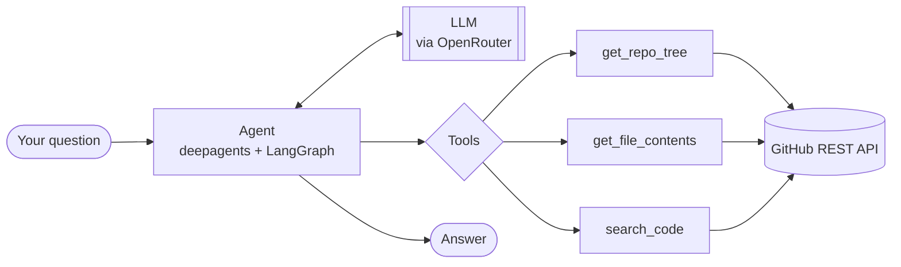

# Repo Cartographer

An AI agent that reads a public GitHub repository and explains it — architecture,
where things happen, and how the pieces fit together.

Instead of cloning a project and reading it top to bottom yourself, you point the
agent at `owner/repo` and ask a question. It walks the file tree, decides which
files are worth opening, reads them, and answers from what it actually found.

Built on [deepagents](https://pypi.org/project/deepagents/) (a LangGraph agent
harness) with a small, deliberately boring GitHub tools layer underneath.

---

## Status

This project is being built in phases, one concept at a time — see
[IMPLEMENTATION_GUIDE.md](IMPLEMENTATION_GUIDE.md) for the full plan and the
reasoning behind the ordering.

| Phase | What it adds | State |
|---|---|---|
| 0 | Environment, packaging, config | Done |
| 1 | GitHub tools layer + tests | Done — 21 tests, no mocking |
| 2 | Bare agent (tools + prompt) | Done — this is what runs today |
| 3+ | Filesystem backend, sub-agents, evals, skills | Planned |

What works right now: a single agent with three GitHub tools that can answer
multi-step questions about a repository. The "write a full onboarding guide"
product described in the implementation guide is still ahead.

---

## How it works



The agent loops: the model picks a tool, the tool calls GitHub, the result goes
back into the model's context, repeat until it can answer. The three tools are
plain Python functions — the library derives each tool's schema and description
from its signature and docstring, so `tools.py` is the single source of truth for
what the model knows about them.

**The tools layer** (`repo_cartographer/tools.py`) is intentionally free of any
LLM or agent code. It's ordinary, testable Python:

| Function | Returns | Notable behaviour |
|---|---|---|
| `get_repo_tree(owner, repo, ref="HEAD")` | Every file path in the repo | Files only — directories and submodules are filtered out, since neither can be read. Raises rather than silently returning a truncated tree. |
| `get_file_contents(owner, repo, path)` | The file as a UTF-8 string | Decodes GitHub's base64 for you. Refuses directories, symlinks, binaries, and files over 1 MB with a message naming the actual problem. |
| `search_code(owner, repo, query)` | Matching results | URL-escapes the query and scopes it to the one repo. No matches is an empty list, not an error. |

Every failure mode raises `GitHubError` (the API said no) or `ValueError` (the
argument pointed somewhere unreadable), so a caller can tell the two apart.

---

## Requirements

- **Python 3.12 or newer** — `uv` will install it for you if you don't have it.
- **[uv](https://docs.astral.sh/uv/)** for dependency management.
- **An OpenRouter API key** — the default model is
  `nvidia/nemotron-3-nano-30b-a3b:free`, which is free to use.
- **A GitHub personal access token** — read-only on public repos is enough.

---

## Setup

The steps are the same on every OS; only installing `uv` and creating the `.env`
file differ. Pick your platform for those two.

### 1. Install uv

<details open>
<summary><b>Linux / macOS</b></summary>

```bash
curl -LsSf https://astral.sh/uv/install.sh | sh
```

Or via a package manager: `brew install uv` (macOS), or your distro's package.
</details>

<details>
<summary><b>Windows (PowerShell)</b></summary>

```powershell
powershell -ExecutionPolicy ByPass -c "irm https://astral.sh/uv/install.ps1 | iex"
```

Or `winget install --id=astral-sh.uv -e`.
</details>

Close and reopen your terminal, then check it worked:

```bash
uv --version
```

### 2. Clone the repository

```bash
git clone https://github.com/ArchitKandu/repo-cartographer.git
cd repo-cartographer
```

### 3. Install dependencies

```bash
uv sync
```

This one command does everything: installs Python 3.12 if it's missing, creates
a `.venv/` in the project, and installs every dependency at the exact versions
pinned in `uv.lock` — so every machine gets an identical environment.

### 4. Add your API keys

Copy the example file, then open `.env` and fill in both values.

<details open>
<summary><b>Linux / macOS</b></summary>

```bash
cp .env.example .env
```
</details>

<details>
<summary><b>Windows (PowerShell)</b></summary>

```powershell
Copy-Item .env.example .env
```
</details>

<details>
<summary><b>Windows (Command Prompt)</b></summary>

```cmd
copy .env.example .env
```
</details>

`.env` should end up looking like this:

```ini
OPENROUTER_API_KEY=sk-or-v1-your-key-here
GITHUB_TOKEN=ghp_your-token-here
```

- **OpenRouter key:** https://openrouter.ai/keys
- **GitHub token:** https://github.com/settings/tokens — a fine-grained token
  with read-only access to public repositories is sufficient. Get one even
  though it's technically optional: unauthenticated GitHub allows 60
  requests/hour against 5000 with a token, and an agent reading file trees
  burns through 60 almost immediately. Code search rejects anonymous requests
  entirely.

`.env` is gitignored. Don't commit it.

### 5. Verify the setup

```bash
uv run pytest
```

Expect `20 passed, 1 deselected`. These tests hit the real GitHub API with no
mocking, so a pass means your token works and the tools genuinely function.

---

## Running it

```bash
uv run python -m repo_cartographer.agent
```

`uv run` is the same command on Linux, macOS, and Windows — it uses the project's
environment without you having to activate anything.

<details>
<summary>Prefer to activate the virtual environment manually?</summary>

You don't need to, but if you want `python` and `pytest` available directly:

| OS / shell | Command |
|---|---|
| Linux / macOS | `source .venv/bin/activate` |
| Windows PowerShell | `.venv\Scripts\Activate.ps1` |
| Windows Command Prompt | `.venv\Scripts\activate.bat` |
| Windows Git Bash | `source .venv/Scripts/activate` |

If PowerShell blocks the script, allow it for your user once with
`Set-ExecutionPolicy -Scope CurrentUser RemoteSigned`. Leave with `deactivate`.
</details>

### Asking your own question

`repo_cartographer/agent.py` ends with a runnable example. Edit the question
there, or import the agent and drive it yourself:

```python
from repo_cartographer.agent import agent

result = agent.invoke({
    "messages": [{
        "role": "user",
        "content": "Explore the flask repo (pallets/flask) and explain its architecture.",
    }]
})
print(result["messages"][-1].content)
```

Give it a genuinely multi-step question. Asking for one fact wastes the harness —
the interesting behaviour shows up when the agent has to plan, explore, and
decide what to read next.

### Using the tools without the agent

The GitHub layer stands alone, with no LLM and no API key involved:

```python
from repo_cartographer import get_repo_tree, get_file_contents

paths = get_repo_tree("pallets", "flask")
print(len(paths), "files")
print(get_file_contents("pallets", "flask", "pyproject.toml"))
```

---

## Project layout

```
repo-cartographer/
├── repo_cartographer/
│   ├── __init__.py      Package marker; re-exports the GitHub tools
│   ├── agent.py         Agent definition + runnable example
│   ├── models.py        LLM configuration (OpenRouter) and .env loading
│   └── tools.py         GitHub API functions — no LLM code
├── tests/
│   └── test_tools.py    Live tests against the real GitHub API
├── .env.example         Template for your keys — copy to .env
├── IMPLEMENTATION_GUIDE.md   The phased build plan
├── pyproject.toml       Dependencies and tool config
└── uv.lock              Exact pinned versions
```

Note that `agent` is deliberately *not* re-exported from `__init__.py`.
Importing it builds an LLM client and reads `OPENROUTER_API_KEY` immediately, so
re-exporting it would make the bare `import repo_cartographer` fail on any
machine without a configured `.env` — including during test collection. Import
it from its own module: `from repo_cartographer.agent import agent`.

---

## Development

```bash
uv run ruff check .          # lint
uv run ruff check . --fix    # lint and autofix
uv run mypy repo_cartographer/   # type check
uv run pytest                # tests (skips the slow one)
uv run pytest -m slow        # the one slow test: a large repo's tree
uv run pytest -v --log-cli-level=INFO   # verbose, with live logs
```

The test suite calls GitHub for real rather than mocking it, which means it can
be affected by your rate limit. It's built to tell the difference: a spent quota
*skips* with an explanation, while a broken or revoked token *fails*, so an
environment problem never gets mistaken for a bug in the tools. If your quota is
nearly exhausted, run a subset with a lower floor:

```bash
PHASE1_MIN_BUDGET=4 uv run pytest
```

---

## Troubleshooting

**`RuntimeError: OPENROUTER_API_KEY is not set`**
Either `.env` doesn't exist yet (step 4) or the key line is empty. The check is
deliberate — it fails at startup with a clear message rather than surfacing as a
confusing `401` from deep inside the agent's reasoning loop.

**`ModuleNotFoundError: No module named 'repo_cartographer'`**
You're running a bare `python` instead of `uv run python`, so the project's
environment isn't active. Use `uv run python -m repo_cartographer.agent`, and
run it from the repository root.

**Tests skip with "cannot reach the GitHub API" or "rate limit"**
Your `GITHUB_TOKEN` is missing, expired, or the hourly quota is spent. Limits
reset hourly; `PHASE1_MIN_BUDGET=4 uv run pytest` runs a reduced set meanwhile.

**`401` or `402` from OpenRouter**
The key is wrong, or the free model is temporarily rate-limited. Free models are
shared and can be busy — change the model name in
[`repo_cartographer/models.py`](repo_cartographer/models.py) to try another.

**PowerShell won't run the activate script**
`Set-ExecutionPolicy -Scope CurrentUser RemoteSigned`, once. Or skip activation
entirely and use `uv run`, which needs no execution-policy change.

---

## Notes on the model

The default is a free model on OpenRouter, chosen so the project can be cloned
and run at no cost. Free models are less capable at multi-step tool use than
frontier ones, so if the agent seems to give up early or skips exploring, swap
the model in `repo_cartographer/models.py` — anything OpenRouter serves works,
since the configuration is a standard OpenAI-compatible client.
