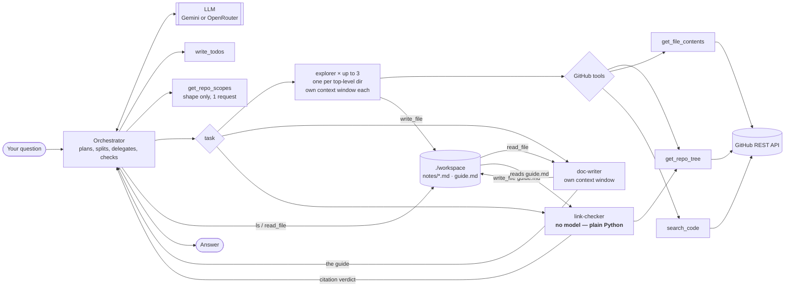

# Repo Cartographer

**Point it at a public GitHub repository and ask a question. It reads the real
code and writes you an onboarding guide.**

```console
$ uv run main.py "Explore psf/requests and explain its architecture: what the main
  modules are, where the Session object is defined, and how requests.get ends up
  sending an HTTP request."
```

It never clones anything. It walks the file tree through the GitHub API, decides
which files are worth opening, opens those, and answers from what it actually
read — with an explicit list of what it did **not** look at, and with every file
path it cites checked against the repository's real tree before you see it.

Built on [deepagents](https://pypi.org/project/deepagents/), a LangGraph agent
harness, over a small and deliberately boring GitHub tools layer.

---

## What it produces

Real output, from a run against `psf/requests`:

```markdown
### What this repository is
`psf/requests` is a widely-used Python HTTP library …

### Architecture
- **Entry Point & API (`src/requests/__init__.py` & `api.py`)**: …
- **Session Management (`src/requests/sessions.py`)**: …

### Where things happen
| What you might want to change | File | Function or Class |
| :--- | :--- | :--- |
| Session state, preparation, dispatch | `src/requests/sessions.py` | `Session.request()`, `Session.send()` |
| Connection handling, urllib3, sending | `src/requests/adapters.py` | `HTTPAdapter.send()` |

### What we did not look at
The notes do not cover the test suite, packaging configuration, or documentation …
```

That last section is required, not incidental. A partial map honest about its
edges is useful; one that reads as complete and is not is worse than nothing.

## Why an agent, rather than a script

Because the useful question is not *"list this repository's files"* — it is
*"where does routing happen"*, and answering that requires deciding what to read
next based on what you just read. A script cannot make that decision. Reading
everything is not an option either: repositories are far larger than any model's
context window, and most of a repository is irrelevant to any given question.

So the work is genuinely agentic — plan, read, decide, read again — and the
interesting engineering is in **what stops it going wrong**. The single worst
outcome here is a guide that confidently cites a file that does not exist,
because a reader will trust it and go looking. Three separate mechanisms address
that, and they are the substance of the project:

| Guard | What it is |
|---|---|
| The doc-writer **has no GitHub tools** | It physically cannot describe a file nobody read. A capability withheld, not an instruction repeated |
| The **link-checker** has no model | Every cited path is matched against the real file tree by plain Python. A fact, not an opinion — and it costs nothing |
| The **eval set** scores six repositories | "It seemed fine when I looked" becomes a number that moves when you change something |

---

## Status

Built in nine phases, one concept at a time. Each has a definition of done stated
in advance and the evidence it produced — all of it in
**[BUILD_LOG.md](BUILD_LOG.md)**.

| Phase | What it adds | State |
|---|---|---|
| 0 | Environment, packaging, config | Done |
| 1 | GitHub tools layer + tests | Done — 26 live tests, no mocking |
| 2 | Bare agent (tools + prompt) | Done |
| 3 | Filesystem backend — context offloading | Done |
| 4a | Explorer + doc-writer sub-agents | Done |
| 4b | Parallel fan-out per directory | Done — trace verified |
| 5 | Eval set: six repos, one score | Done |
| 6 | Link-checker: a sub-agent with no model in it | Done |
| 7 | Skills + `AGENTS.md`: instructions out of the code | Done |
| 8 | Approval gate on the one irreversible action | Done |
| 9 | Packaging: CI and a deploy | Planned |

**What runs today:** an orchestrator that sizes a repository up and splits it
across up to three explorers; explorers that read one directory each and take
notes; a doc-writer with no repository access that turns those notes into the
guide; and a link-checker with no model that verifies every path the guide cites.
One capability can change anything outside this machine — opening a draft pull
request — and it is gated behind human approval and switched off by default.

**Deliberately absent:** the good-first-issues section the project's own
description promises. Nothing here can read an issue tracker yet, so
`DOC_WRITER_PROMPT` forbids inferring issues from code rather than letting the
model invent them.

## Which document do I want?

| Document | What it answers |
|---|---|
| **README** (you are here) | What it is, what it produces, how to run it |
| **[ARCHITECTURE.md](ARCHITECTURE.md)** | How it works, from scratch — the agents, the files, one real run traced step by step, and the fifteen decisions that *are* the architecture. Assumes no prior knowledge of the codebase |
| **[BUILD_LOG.md](BUILD_LOG.md)** | What each phase isolated, and the measurement that showed it worked |
| **[IMPLEMENTATION_GUIDE.md](IMPLEMENTATION_GUIDE.md)** | The plan the phases follow, and why they are ordered that way |
| **[AGENTS.md](AGENTS.md)** | House style for the guides the agent writes — editable without touching Python |

---

## How it works



Up to six agents, one workspace. The orchestrator can learn a repository's
*shape* and nothing else — `get_repo_scopes` returns directory names and file
counts in one request, which is enough to divide the work and not enough to
describe the code. Each explorer reads one top-level directory and writes its own
notes file; the doc-writer has no repository access at all and builds the guide
from those notes. Every sub-agent runs in its own message thread, so a file an
explorer reads never enters the orchestrator's context — only the explorer's short
final report does.

Two channels carry work across those boundaries and there are no others: a
sub-agent's final message, and files in the shared workspace. That constraint is
the cost of isolation, and it is why the handoff conventions are stated in all
three prompts rather than assumed.

Each agent loops: the model picks a tool, the tool runs, the result goes back into
that agent's context, repeat until it can answer. The three GitHub tools are plain
Python functions — the library derives each tool's schema and description from its
signature and docstring, so `tools.py` is the single source of truth for what the
model knows about them.

There are two namespaces here and keeping them apart is most of the prompts' job.
GitHub is remote and read-only; the workspace is local, writable, and starts
empty, so `read_file` reaches a repository file only after some agent has put one
there. Every agent gets a deliberately narrow set:

| | GitHub | workspace | other |
|---|---|---|---|
| orchestrator | `get_repo_scopes` only | `ls`, `read_file` | `task`, `write_todos`, `open_pull_request` **(human-gated)** |
| explorer (×N) | `get_repo_tree`, `get_file_contents`, `search_code` | `read_file`, `write_file` | `skills/` (read-only) |
| doc-writer | — | `ls`, `read_file`, `write_file` | `AGENTS.md`, always applied |
| link-checker | `get_repo_tree`, in Python | reads `/guide.md` directly | **no tools — it has no model to offer them to** |

Two mechanisms produce that table, and they are not interchangeable.
[`middleware.py`](repo_cartographer/middleware.py) hides tools from the
orchestrator per model request — the tool node still holds them, the model is just
never told. Each sub-agent instead restates `FilesystemMiddleware(tools=[...])` in
its own spec, which is stronger: an excluded tool is never constructed, so it
cannot be dispatched at all. Sub-agents need their own because **a parent's
middleware is not inherited by declarative sub-agents** — omit it and both
delegates get `execute`, `glob`, `grep` and `delete` handed straight back.

`tests/test_wiring.py` pins all of it, with no model involved:

```console
$ uv run pytest tests/test_wiring.py -q
18 passed
```

Both halves of the table are deliberate:

- **`write_todos` is added.** It comes from `TodoListMiddleware`, passed
  explicitly — as of deepagents 0.7.3 planning is *not* in the default middleware
  stack. Mapping a repo is several steps deep, so
  [`ORCHESTRATOR_PROMPT`](repo_cartographer/prompts.py) asks for a todo list before
  the first tool call, and the agent writes one.
- **Six built-ins are taken away from the orchestrator.** `create_deep_agent` also
  supplies `glob`, `grep`, `delete` and a shell (`execute`); none has anything to
  do here, and `execute` has no sandbox backend so it only ever returns an error.
  `write_file` and `edit_file` joined that list at Phase 4, when writing moved out
  of the orchestrator — its explorer writes and its doc-writer reads, and it only
  checks. There is a second reason beyond wasted turns: an orchestrator that can
  edit its delegates' notes can quietly launder them.
  This mattered most at Phase 2, when the whole filesystem was hidden: the first
  model tried here spent 8 of 16 tool calls on `read_file("src/foo.py") → not
  found` before the workspace had any purpose, and removing the tools halved what
  a run cost.
- **The default `general-purpose` sub-agent is switched off.** `create_deep_agent`
  adds one to the `task` menu unless told otherwise, advertised to the model as
  having "all tools as the main agent" — which, now that the orchestrator holds
  none, means none. A delegate that can do nothing, described as the one that can
  do anything. A `HarnessProfile` registered against the active model removes it;
  the key is built in [`models.py`](repo_cartographer/models.py) because its shape
  differs per provider, and a key that fails to match doesn't raise — it silently
  leaves the default in place, which is why a test asserts the menu instead of
  trusting the call.

**Offloading.** `FilesystemMiddleware` watches every tool result and writes any
one over `TOOL_RESULT_TOKEN_LIMIT` (2,000 tokens, well below the library's 20,000
default) into the workspace, leaving a head-and-tail preview and a path in the
thread. This is what keeps a 10,000-token file from being re-sent on every
subsequent turn, and it applies to the GitHub tools too — the exclusion list in
the library covers only its own built-ins. On top of that the prompt asks the
agent to keep `/notes.md` as it reads and to answer from the notes rather than
from the sources, so what survives to the final turn is the summary and not the
files.

Worth being precise about what the *backend* buys, since it's easy to overclaim:
files land in `./workspace` rather than in graph state, and that is a durability
change, not a context one — a `StateBackend` keeps file contents out of the
message thread just as well. Disk is what lets you read `workspace/notes.md`
afterwards and see what the agent actually wrote down.

**The tools layer** (`repo_cartographer/tools.py`) is intentionally free of any
LLM or agent code. It's ordinary, testable Python:

| Function | Returns | Notable behaviour |
|---|---|---|
| `get_repo_tree(owner, repo, ref="HEAD")` | Every file path in the repo | Files only — directories and submodules are filtered out, since neither can be read. Raises rather than silently returning a truncated tree. |
| `get_file_contents(owner, repo, path)` | The file as a UTF-8 string | Decodes GitHub's base64 for you. Refuses directories, symlinks, binaries, and files over 1 MB with a message naming the actual problem. |
| `search_code(owner, repo, query)` | Matching results | URL-escapes the query and scopes it to the one repo. No matches is an empty list, not an error. |

Every failure mode raises `GitHubError` (the API said no, or could not be reached
at all) or `ValueError` (the argument pointed somewhere unreadable), so a caller
can tell the two apart. All four go through one helper that retries a dropped or
timed-out connection three times — and only that, never an HTTP answer, since a
404 will not become a 200 and a 403 from the search quota gets worse if you ask
again. Phase 5 is where that turned out to matter; see
[the first thing the eval set caught](BUILD_LOG.md#the-first-thing-it-caught-was-not-the-agent).

---

## Requirements

- **Python 3.12 or newer** — `uv` will install it for you if you don't have it.
- **[uv](https://docs.astral.sh/uv/)** for dependency management.
- **A model provider key** — either a
  [Google AI Studio key](https://aistudio.google.com/apikey) (recommended: 500
  requests/day free, no card) or an [OpenRouter key](https://openrouter.ai/keys)
  (50/day free). Both are free; see [Notes on the model](#notes-on-the-model) for
  which to use when.
- **A GitHub personal access token** — read-only on public repos is enough.

---

## Setup

The steps are the same on every OS; only installing `uv` and creating the `.env`
file differ. Pick your platform for those two.

### 1. Install uv

<details open>
<summary><b>Linux / macOS</b></summary>

```bash
curl -LsSf https://astral.sh/uv/install.sh | sh
```

Or via a package manager: `brew install uv` (macOS), or your distro's package.
</details>

<details>
<summary><b>Windows (PowerShell)</b></summary>

```powershell
powershell -ExecutionPolicy ByPass -c "irm https://astral.sh/uv/install.ps1 | iex"
```

Or `winget install --id=astral-sh.uv -e`.
</details>

Close and reopen your terminal, then check it worked:

```bash
uv --version
```

### 2. Clone the repository

```bash
git clone https://github.com/ArchitKandu/repo-cartographer.git
cd repo-cartographer
```

### 3. Install dependencies

```bash
uv sync
```

This one command does everything: installs Python 3.12 if it's missing, creates
a `.venv/` in the project, and installs every dependency at the exact versions
pinned in `uv.lock` — so every machine gets an identical environment.

### 4. Add your API keys

Copy the example file, then open `.env` and fill in both values.

<details open>
<summary><b>Linux / macOS</b></summary>

```bash
cp .env.example .env
```
</details>

<details>
<summary><b>Windows (PowerShell)</b></summary>

```powershell
Copy-Item .env.example .env
```
</details>

<details>
<summary><b>Windows (Command Prompt)</b></summary>

```cmd
copy .env.example .env
```
</details>

`.env` should end up looking like this:

```ini
GEMINI_API_KEY=AIza-your-key-here
GITHUB_TOKEN=ghp_your-token-here
```

One model provider is required. Configure both and `LLM_PROVIDER` picks between
them; configure one and it is used automatically.

- **Google AI Studio key:** https://aistudio.google.com/apikey — no card
  required, and the higher free request budget of the two.
- **OpenRouter key (optional):** https://openrouter.ai/keys
- **GitHub token:** https://github.com/settings/tokens — a fine-grained token
  with read-only access to public repositories is sufficient. Get one even
  though it's technically optional: unauthenticated GitHub allows 60
  requests/hour against 5000 with a token, and an agent reading file trees
  burns through 60 almost immediately. Code search rejects anonymous requests
  entirely.

`.env` is gitignored. Don't commit it.

### 5. Verify the setup

```bash
uv run pytest
```

Expect `134 passed, 1 deselected`. These tests hit the real GitHub API with no
mocking, so a pass means your token works and the tools genuinely function. No
model is called anywhere in the suite, so it costs nothing against your provider
quota. A few tests skip themselves rather than fail if GitHub is unreachable or
your hourly quota is spent — an environment problem is not a bug in the code.

---

## Running it

Ask your own question:

```bash
uv run main.py "Explore pallets/flask and explain how routing works."
```

Or run the built-in example ask, which maps `pallets/flask`:

```bash
uv run python -m repo_cartographer.agent
```

`uv run` is the same command on Linux, macOS, and Windows — it uses the project's
environment without you having to activate anything.

<details>
<summary>Prefer to activate the virtual environment manually?</summary>

You don't need to, but if you want `python` and `pytest` available directly:

| OS / shell | Command |
|---|---|
| Linux / macOS | `source .venv/bin/activate` |
| Windows PowerShell | `.venv\Scripts\Activate.ps1` |
| Windows Command Prompt | `.venv\Scripts\activate.bat` |
| Windows Git Bash | `source .venv/Scripts/activate` |

If PowerShell blocks the script, allow it for your user once with
`Set-ExecutionPolicy -Scope CurrentUser RemoteSigned`. Leave with `deactivate`.
</details>

### Driving it from Python

```python
from repo_cartographer.agent import ask

print(ask("Explore pallets/flask and explain its architecture."))
```

`ask()` is a thin wrapper. For the full message history — every tool call, in
order, which is what you want when you're studying the agent's behaviour rather
than its answer — invoke the graph directly:

```python
from repo_cartographer.agent import agent

result = agent.invoke(
    {"messages": [{"role": "user", "content": "..."}]},
    config={"recursion_limit": 60},
)
for message in result["messages"]:
    for call in getattr(message, "tool_calls", None) or []:
        print(call["name"])

print(result["messages"][-1].text)   # `.text`, not `.content` — see below
```

Read the answer off `.text`, not `.content`. On Gemini, `content` is a list of
typed blocks (the prose plus an encrypted thought signature), so printing it
dumps a repr of that structure; on OpenRouter it happens to be a plain string.
`.text` gives you the prose on both.

Give it a genuinely multi-step question. Asking for one fact wastes the harness —
the interesting behaviour shows up when the agent has to plan, explore, and
decide what to read next.

### Using the tools without the agent

The GitHub layer stands alone, with no LLM and no API key involved:

```python
from repo_cartographer import get_repo_tree, get_file_contents

paths = get_repo_tree("pallets", "flask")
print(len(paths), "files")
print(get_file_contents("pallets", "flask", "pyproject.toml"))
```

---

## Project layout

```
repo-cartographer/
├── repo_cartographer/
│   ├── __init__.py      Package docstring; re-exports the GitHub tools
│   ├── agent.py         build_agent(), build_subagents(), ask() — the wiring
│   ├── prompts.py       The three prompts: orchestrator, explorer, doc-writer
│   ├── middleware.py    Hides the built-ins the orchestrator doesn't use
│   ├── models.py        Provider selection (Google / OpenRouter), .env loading
│   ├── citations.py     Does this cited path exist? — no LLM code
│   ├── link_checker.py  The graph around citations.py — a sub-agent with no model
│   ├── skills.py        Mounts skills/ read-only; loads AGENTS.md
│   ├── pull_requests.py The one irreversible action, behind two guards
│   └── tools.py         Four GitHub API functions — all reads, no LLM code
├── skills/
│   ├── python-repo/SKILL.md   Read only when the repo is Python
│   └── node-repo/SKILL.md     Read only when the repo is JS/TS
├── AGENTS.md            House style — appended to the doc-writer every run
├── scripts/
│   ├── measure_context.py   Phase 3's A/B: offloading on vs. off
│   ├── show_contexts.py     Phase 4: per-agent context, via subgraphs=True
│   ├── run_evals.py         Phase 5: six repos in, one score out
│   ├── prove_link_checker.py  Phase 6: plant a fake path, watch it get caught
│   ├── show_skills.py       Phase 7: a Python repo and a JS repo, back to back
│   └── prove_approval_gate.py  Phase 8: trigger the gate, watch it stop
├── tests/
│   ├── test_tools.py    Live tests against the real GitHub API
│   ├── test_wiring.py   The four-way split, asserted without a model
│   ├── test_citations.py  Does the checker catch an invented path? (no model)
│   ├── test_skills.py   Are the skills found, reachable, and unwritable? (no model)
│   ├── test_approval.py Is the irreversible action really gated? (no model)
│   ├── test_evals.py    Is the eval set itself true? (live GitHub, no model)
│   └── evals/
│       ├── known_repos.jsonl   The dataset: 6 repos, 31 expected facts
│       ├── dataset.py          Loads and validates it, strictly
│       ├── scoring.py          Is this fact in this guide? No model involved
│       └── results/            Recorded runs — git-ignored
├── workspace/           The agent's scratch space — git-ignored, run output
├── main.py              CLI: uv run main.py "your question"
├── .env.example         Template for your keys — copy to .env
├── ARCHITECTURE.md      How the whole system works, start to finish
├── BUILD_LOG.md         What each phase proved, and how it was measured
├── IMPLEMENTATION_GUIDE.md   The phased build plan
├── langgraph.json       Graph entry point for LangGraph Studio / Platform
├── pyproject.toml       Dependencies, plus the ruff and mypy configuration
└── uv.lock              Exact pinned versions
```

**Two boundaries run through that tree, and they are the reason it is shaped this
way.**

The first is *wiring* versus *content*. `agent.py` decides which model, which
tools, which middleware and in what order; `prompts.py`, `skills/` and
`AGENTS.md` say what the agents should do with them. A reworded bullet and a
changed graph are different kinds of change, made for different reasons and
reviewed differently, so they live in different files. Since Phase 7 the second
group is mostly *not Python at all*: the ecosystem conventions and the house
style are markdown a person can edit without opening an editor on the code.

The second is *deterministic* versus *probabilistic*. `tools.py` and
`citations.py` contain no AI code whatsoever, which is what lets them be tested
for real — against live GitHub, or against a list of strings — rather than
sampled. Everything uncertain in this system is confined to the modules that
talk to a model, and the two most important guarantees it makes are enforced
from the certain half.

`build_agent()` takes exactly one argument, `tool_result_token_limit`, and that
is deliberate — it is the variable Phase 3 measures. Passing `None` disables
offloading and gives the control arm: same prompt, same tools, same workspace,
but large tool results stay inline. `agent` is the module-level default with
offloading on.

Note that `agent` is deliberately *not* re-exported from `__init__.py`.
Importing it builds an LLM client and needs a provider key immediately, so
re-exporting it would make the bare `import repo_cartographer` fail on any
machine without a configured `.env` — including during test collection. Import
it from its own module: `from repo_cartographer.agent import agent`.

---

## Development

### The checks

```bash
uv run ruff check .          # lint
uv run ruff check . --fix    # lint and autofix
uv run mypy                  # type check — package, scripts and tests
uv run pytest                # 134 tests (skips the slow one)
uv run pytest -m slow        # the one slow test: a large repo's tree
uv run pytest -v --log-cli-level=INFO   # verbose, with live logs
```

All three are clean, and the configuration for the first two lives in
`pyproject.toml` with a comment explaining every rule that is switched off.
Three things about that setup are worth knowing before you change anything:

- **Ruff runs a wide rule set, not the default.** Ruff's defaults are close to
  bare pyflakes, while this code was written against a much larger set for
  several phases — `# noqa: TRY004`, `# noqa: BLE001` and `# noqa: C901` all
  name rules nothing was enforcing. Those comments documented an intention no
  tool checked, and one of them had already gone stale. The config now enables
  the set the code was already assuming.
- **Mypy covers the tests too.** They are the part of this repository that
  reaches into library internals — a `task` tool's closure, a middleware's
  resolved config — so they are where a type error is most likely and least
  visible.
- **Pytest treats a warning as a failure.** A warning is a defect that has not
  failed yet. Third-party deprecations are the deliberate exception: they are
  real, but they are somebody else's release schedule, and failing on them would
  mean the suite breaks on a dependency bump rather than on a change here.

### The scripts

Each phase's evidence is reproducible, and each script says what it costs before
you run it. Anything below that calls a model spends real quota.

```bash
uv run scripts/measure_context.py               # Phase 3's A/B, 2 model runs
uv run scripts/measure_context.py --repeats 3   # ...with ranges, 6 model runs

uv run scripts/run_evals.py                     # Phase 5's score, 6 model runs
uv run scripts/run_evals.py --case flask        # ...one repo only
uv run scripts/run_evals.py --score-only        # re-score recorded runs, free
uv run scripts/run_evals.py --history           # every run recorded so far

uv run scripts/prove_link_checker.py            # Phase 6's proof, ~2 model requests
uv run scripts/show_skills.py                   # Phase 7's proof, 2 model runs
uv run scripts/prove_approval_gate.py           # Phase 8's proof, 2 model runs

uv run scripts/show_contexts.py                 # Phase 4: per-agent context, 1 run
```

`measure_context.py` needs a repository with files large enough to cross the
2,000-token eviction threshold, or it will correctly report that nothing was
offloaded and the difference is noise.

`run_evals.py --score-only` is the one to reach for while iterating: it re-scores
the guides already on disk against the current dataset, instantly and for free,
and warns you when those guides predate the instructions now in the repository.

The test suite calls GitHub for real rather than mocking it, which means it can
be affected by your rate limit. It's built to tell the difference: a spent quota
*skips* with an explanation, while a broken or revoked token *fails*, so an
environment problem never gets mistaken for a bug in the tools. If your quota is
nearly exhausted, run a subset with a lower floor:

```bash
PHASE1_MIN_BUDGET=4 uv run pytest
```

---

## Troubleshooting

**`RuntimeError: No model provider is configured`**
Either `.env` doesn't exist yet (step 4) or both key lines are empty. The check is
deliberate — it fails at startup with a clear message rather than surfacing as a
confusing `401` from deep inside the agent's reasoning loop.

**`400 Function call is missing a thought_signature`**
You're reaching Gemini through an OpenAI-compatible client. Gemini needs its
native one — see [Notes on the model](#notes-on-the-model).

**`ModuleNotFoundError: No module named 'repo_cartographer'`**
You're running a bare `python` instead of `uv run python`, so the project's
environment isn't active. Use `uv run python -m repo_cartographer.agent`, and
run it from the repository root.

**Tests skip with "cannot reach the GitHub API" or "rate limit"**
Your `GITHUB_TOKEN` is missing, expired, or the hourly quota is spent. Limits
reset hourly; `PHASE1_MIN_BUDGET=4 uv run pytest` runs a reduced set meanwhile.

**`429 Rate limit exceeded: free-models-per-day` from OpenRouter**
The free tier's 50 requests/day is spent; it resets at midnight UTC. Ten credits
($10, one time) raise the cap to 1,000/day — see
[Notes on the model](#notes-on-the-model).

**`401` or `402` from OpenRouter**
The key is wrong, or the free endpoint is busy — free models are shared. Set
`OPENROUTER_MODEL` in `.env` to try another.

**PowerShell won't run the activate script**
`Set-ExecutionPolicy -Scope CurrentUser RemoteSigned`, once. Or skip activation
entirely and use `uv run`, which needs no execution-policy change.

---

## Notes on the model

Two providers, because on free tiers no single one is good at both jobs this
project has. Pick with `LLM_PROVIDER`; with only one key configured it is used
automatically.

| | `google` (default) | `openrouter` |
|---|---|---|
| Default model | `gemini-3.5-flash-lite` | `nemotron-3-super-120b-a12b:free` |
| Requests/day | **500** | 50 |
| Requests/minute | 15 | 20 |
| Mapping runs/day | ~50 | ~5 |
| Best for | iterating on the prompt | runs whose output matters |

**Watch Gemini's per-model daily caps.** They are not uniform, and reaching for a
bigger model costs you the ability to run at all:

| Model | RPM | TPM | RPD | Runs/day |
|---|---|---|---|---|
| `gemini-3.6-flash` | 5 | 250K | **20** | ~2 |
| `gemini-3.5-flash` | 5 | 250K | **20** | ~2 |
| **`gemini-3.5-flash-lite`** | 15 | 250K | **500** | **~50** |
| `gemini-3.1-flash-lite` | 15 | 250K | 500 | ~50 |
| `gemma-4-31b` | 30 | **16K** | 14,400 | token-bound |
| `gemini-*-pro` | — | — | 0 | unavailable on free tier |

`gemma-4-31b` is the interesting one: effectively unlimited requests, but 16K
input tokens/minute, which an agent loop exceeds within a few turns because it
resends the whole history each time. Phase 3's offloading helps here and was
partly built for it, though not enough to rescue this model on a real repo: the
measured `psf/requests` run still reached 21K tokens on its final turn with
offloading on. The ceiling moved; it is still below what the task needs.

### Why Gemini needs its native client

Google's OpenAI-compatible endpoint does **not** work for this. Gemini 3 models
think by default, and every function call they emit carries an encrypted
`thought_signature` that a stateless client must send back verbatim on the next
turn. The compatibility layer drops it, so the second turn of any tool-calling
loop dies with:

```
400 Function call is missing a thought_signature in functionCall parts.
```

`langchain-google-genai`'s `ChatGoogleGenerativeAI` round-trips it. OpenRouter
still uses `ChatOpenAI`.

### Why not the smallest model

The project first ran on `nvidia/nemotron-3-nano-30b-a3b:free` (3B active
parameters). Measured on the same `psf/requests` ask, it:

- **never wrote a plan**, even with `write_todos` available and the prompt asking
  for one first — precisely what Phase 2's definition of done turns on;
- spent 8 of 16 tool calls on `read_file`/`ls` against the empty workspace,
  including three identical retries of a path that had already 404'd;
- reached a correct answer, just wastefully.

Multi-step tool use is where small models fall down first, and this task is
nothing but multi-step tool use. The planning failure was fixed by moving to a
capable-enough model. The wasted `read_file` calls were fixed at Phase 2 by hiding
the workspace tools outright; Phase 3 gave them back, so what keeps the model from
repeating that mistake is the prompts drawing the line between a remote read-only
repository and a local workspace that starts empty — a weaker guarantee than
removal, and the reason the distinction is stated twice in both
[`ORCHESTRATOR_PROMPT` and `EXPLORER_PROMPT`](repo_cartographer/prompts.py).

Phase 4 narrows the opening again from a different direction: the only agent that
can reach GitHub now holds just `read_file` and `write_file` on the workspace, and
the only agent that could confuse the two namespaces is the one whose prompt spends
the most words on the distinction. The doc-writer, which has no GitHub tools at
all, cannot make the mistake in either direction.

### If you stay on OpenRouter

Its free tier allows 20 requests/minute and 50/day across all `:free` models
combined — about three runs. A one-time purchase of **10 credits ($10) raises the
daily cap to 1,000**, permanently; the credits are not spent by `:free` models,
so it is a deposit rather than a bill. When the cap is spent you get a `429` with
`limit_source: openrouter_free_tier_daily` and a reset timestamp (midnight UTC).

Avoid `openrouter/free` — it picks a free model at random per request, so no run
is reproducible, which breaks both Phase 2's definition of done and Phase 5's
evals.
